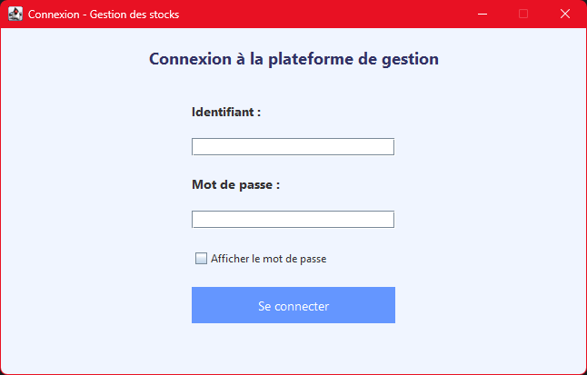
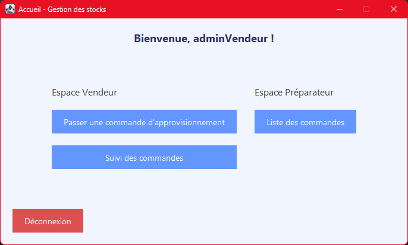

# 🐝 EasyBee - Gestion d'approvisionnement en matériel apicole


## 🌍 Contexte

**EasyBee** est une entreprise fictive spécialisée dans la vente de matériel apicole (ruches, combinaisons, pots, etc.). Afin de résoudre divers problèmes liés à la gestion des stocks, l'entreprise a décidé d'optimiser son processus d'approvisionnement.

Une solution logicielle sous forme d’application Java a donc été développée. Elle est destinée aux salariés (vendeurs et préparateurs) et permet de passer, suivre et préparer des commandes d'approvisionnement entre le magasin et l'entrepôt.

---

## ⚙️ Fonctionnalités

### 👨‍💼 Magasin

* Passer une commande lorsqu’un produit est en rupture.
* Confirmer la réception d’une commande.
* Suivre l’état des commandes (En attente, En cours, Terminée).

### 🏭 Entrepôt

* Consulter les commandes en attente.
* Préparer une commande à partir de ses détails.
* Mettre à jour le statut d’une commande.

---

## 📋 Prérequis

* Java (version recommandée : 17 ou supérieure)
* IDE Java (Eclipse, IntelliJ, NetBeans, etc.)
* MySQL (version 8 ou supérieure) ou autre SGBDR compatible

---

## 🚀 Installation

### 🗃️ Base de données

1. Importez le fichier `easybee_projet2.sql` dans votre serveur MySQL. *(Ce fichier contient la structure de la base de données ainsi que des données de test.)*

### 💻 Application

1. Clonez ou téléchargez ce dépôt :

   ```bash
   git clone https://github.com/Sadrinho27/EasyBeeJava.git
   ```

2. Importez le projet dans votre IDE :

   * Ouvrez votre IDE.
   * Choisissez "Importer un projet existant" ou une option équivalente.

3. Configurez les paramètres de connexion à la base dans le fichier `ConnexionBdd.java`.

### ▶️ Lancement

1. Ouvrez le fichier `App.java`.
2. Exécutez l’application.
3. Connectez-vous avec les identifiants de test fournis ci-dessous.

---

## 🔐 Comptes de test

| Rôle        | Identifiant    | Mot de passe   |
| ----------- | -------------- | -------------- |
| Vendeur     | `adminVendeur` | `adminVendeur` |
| Préparateur | `adminPrepa`   | `adminPrepa`   |

> 🔒 *Les mots de passe sont stockés de manière sécurisée (hashés dans la base). Ces identifiants sont fournis à des fins de démonstration uniquement.*

---

## 🧪 Testé avec

* Java 17
* MySQL 9.1.0
* Eclipse 2025-03
* Windows 10/11

---

## 🖼️ Aperçu




---

## 📄 Licence

Ce projet est à usage personnel ou pédagogique. Non destiné à un usage en production sans révision approfondie.

---

## 👤 Auteur

Développé par [@Sadrinho27](https://github.com/Sadrinho27).
